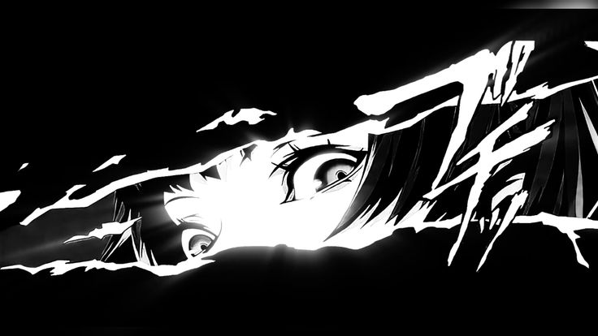

## Hello World! I'm Aress 👋

<!--
**Areess826/Areess826** is a ✨ _special_ ✨ repository because its `README.md` (this file) appears on your GitHub profile.

Here are some ideas to get you started:

- 🔭 I’m currently working on ...
- 🌱 I’m currently learning ...
- 👯 I’m looking to collaborate on ...
- 🤔 I’m looking for help with ...
- 💬 Ask me about ...
- 📫 How to reach me: ...
- 😄 Pronouns: ...
- ⚡ Fun fact: ...
-->
- ⛺I'am Still in School and Pursuing High School Education.
- ⛺I'm a Full-Stack Developer
- ⛺I'm a Tech Enthusiast and a Passionate Learner.
- ⛺I'm currently learning HTML/CSS,JAVASCRIPT,PHP,MYSQL,FLUTTER.TAILWIND,C++,LARAVEL,FIGMA,PYTHON,

#### Skills

#### Socials

##### My Github Stats

Play games with me

###

<picture>
  <source media="(prefers-color-scheme: dark)" srcset="https://raw.githubusercontent.com/Areess826/Areess826/output/pacman-contribution-graph-dark.svg">
  <source media="(prefers-color-scheme: light)" srcset="https://raw.githubusercontent.com/Areess826/Areess826/output/pacman-contribution-graph.svg">
  
</picture>

###

###

